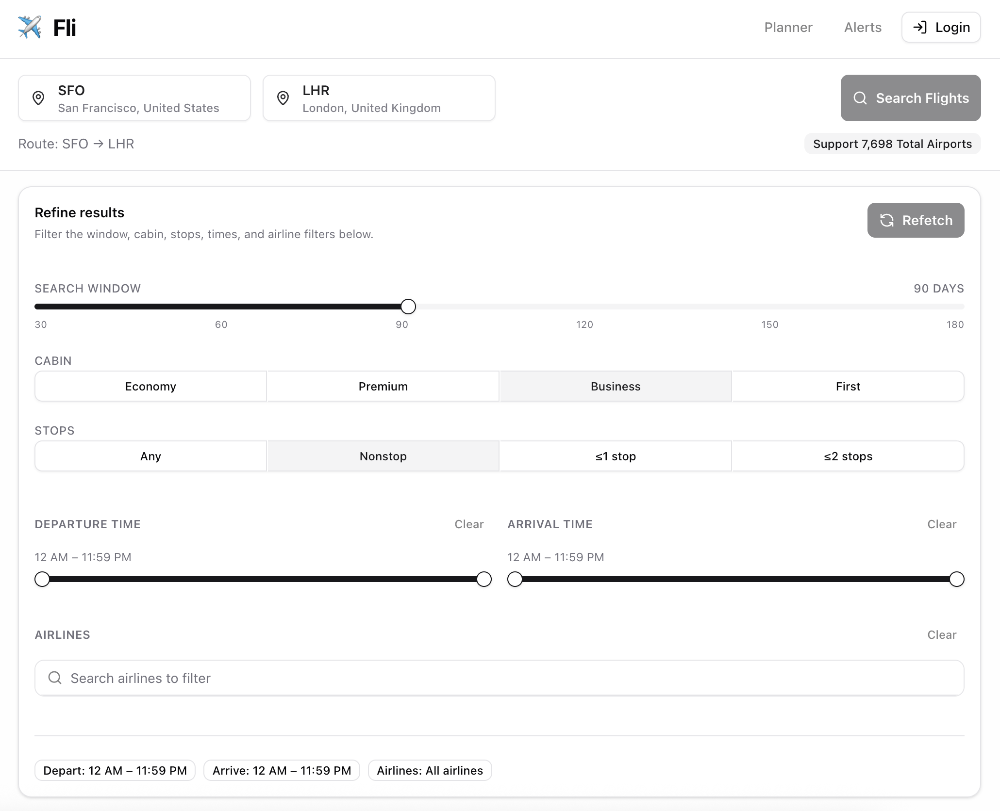
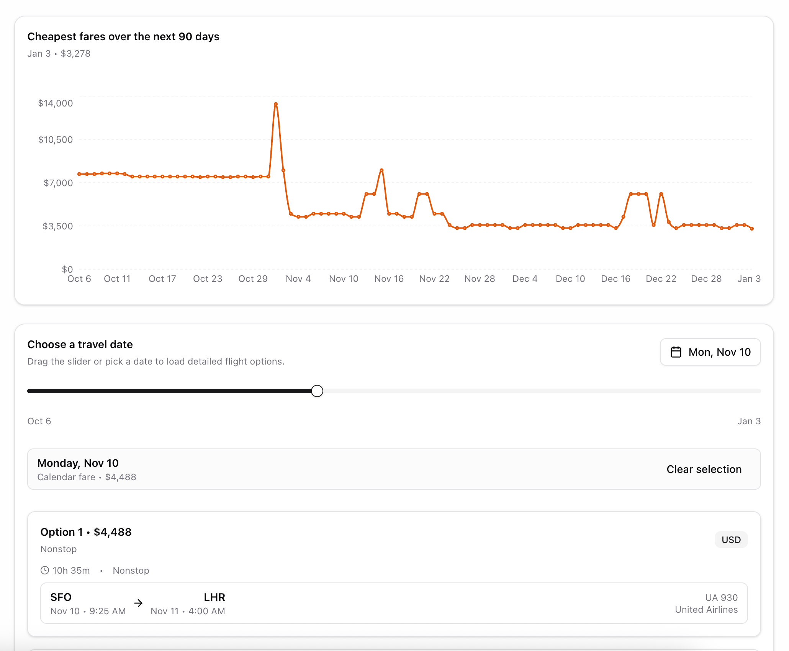

# GrayPane – Flight Search & Alerts

GrayPane helps travelers check available flights, monitor price trends, plan upcoming trips, and create personalized alerts. The application is built with Next.js 15, React 19, Supabase authentication, a PostgreSQL database via Drizzle ORM, Apple MapKit visualizations, Tailwind CSS, and TypeScript.

## Key Features

* Search for flights and review route availability in real time with comprehensive filtering.
* Track fare changes and set alert thresholds for routes of interest.
* Search award flight availability via seats.aero integration with async processing.
* Plan itineraries with Supabase-backed user dashboards.
* Create, edit, and manage alert rules with validation safeguards.
* Automated alert processing with Cloudflare Workers and scheduled email notifications.
* Explore airports with Apple MapKit maps and responsive Tailwind UI components.

## Tech Stack

* **Frontend:** Next.js 15, React 19, Tailwind CSS, Radix UI primitives, next-themes, Sonner, tRPC.
* **Backend:** Next.js Server Actions, tRPC API layer, Supabase SSR client, Drizzle ORM.
* **Workers:** Cloudflare Workers with Workflows and Queues for alert processing.
* **Database:** PostgreSQL with prefixed ULID identifiers.
* **Notifications:** Resend for email delivery, custom templates.
* **Monitoring:** Sentry for error tracking and performance monitoring.
* **Tooling:** TypeScript, Bun test runner with happy-dom, Biome formatter/linter, Bun runtime.

## Prerequisites

* Install [Bun](https://bun.sh/) for dependency management and scripts.
* Copy `.env.example` to `.env.local` and populate the required variables validated by `@t3-oss/env-nextjs`.

## Getting Started

1. Install dependencies: `bun install`
2. Run the development server: `bun run dev`
3. Open `http://localhost:3000` to use Flights Tracker.

## Available Scripts

### Application

* `bun run dev` – Start the Turbopack development server.
* `bun run build` – Produce an optimized production bundle.
* `bun start` – Serve the production build.

### Testing

* `bun test` – Execute all tests with Bun's built-in test runner.
* `bun run test:watch` – Run tests in watch mode.
* `bun run test:fli` – Run fli integration tests with extended timeout.
* `bun run test:workers` – Run Cloudflare Worker tests (37 tests).
* `bun run test:workers:watch` – Run worker tests in watch mode.

### Code Quality

* `bun run lint` – Check code style with Biome.
* `bun run format` – Format the codebase with Biome.

### Workers (Cloudflare)

* `bun run worker:dev` – Start worker with local development server.
* `bun run worker:deploy` – Deploy worker to Cloudflare.
* `bun run worker:tail` – Stream live logs from production worker.
* `bun run trigger:alerts` – Manually trigger alert processing (production).
* `bun run trigger:alerts:local` – Manually trigger alert processing (local).

## Database & Migrations

* Schema definition: `src/db/schema.ts`
* Database configuration: `drizzle.config.ts`
* Migrations directory: `./migrations`
* Commands:
  * `bun run db:generate` – Generate migration files from schema changes.
  * `bun run db:push` – Push schema updates directly to the development database.
  * `bun run db:migrate` – Apply pending migrations.
  * `bun run db:studio` – Open Drizzle Studio for database exploration.

## Architecture Overview

### API Layer

**tRPC Architecture**: End-to-end type-safe API with:

* Server routers in `src/server/routers/` for alerts, flights, airports, and seats.aero
* React Query integration via `@trpc/react-query` for client-side data fetching
* Automatic error handling and validation with Zod schemas
* Real-time subscriptions support

### Database Layer

Drizzle ORM manages PostgreSQL entities:

* Core tables: `airport`, `airline`, `alert` with JSONB filters
* Workers tables: `seats_aero_search_request`, `seats_aero_availability_trip`
* Notification table for email tracking and rate limiting

### Authentication & Middleware

Supabase handles authentication with SSR support. Middleware in `src/middleware.ts` to validate sessions and enforce public-route access rules.

### Business Logic

**Core Services**:

* `src/core/alerts-service.ts` - High-level alert business logic
* `src/core/alerts-db.ts` - Database operations for alerts
* `src/core/seats-aero.db.ts` - Seats.aero data management
* `src/core/filters.ts` - Zod schemas for alert filters (versioned)
* `src/lib/notifications/` - Email templates and delivery system

**Worker Adapters**:

* `src/workers/adapters/` - Thin wrappers around core services
* `src/workers/utils/` - Worker-specific utilities (logger, Sentry)

### Alert Processing (Cloudflare Workers)

Automated alert processing runs on Cloudflare Workers with:

* **Cron Triggers**: Every 6 hours (00:00, 06:00, 12:00, 18:00 UTC)
* **Workflows**: Durable execution with automatic retries and state persistence
* **Queues**: Process up to 10 users concurrently with auto-scaling
* **Email Scheduling**: Sends daily emails between 6-9 PM UTC, max once per 24 hours
* **Monitoring**: Full Sentry integration for error tracking and performance monitoring
* **Testing**: Comprehensive test suite with 37 passing tests
* **Performance**: Optimized with parallel async operations throughout

See `docs/workflows.md` for complete deployment and monitoring guide.

### UI Components

Reusable components reside in `src/components/ui`, while custom features like `airport-search` and `airport-map` integrate Apple MapKit and Tailwind styling. Path alias `@/*` maps to `./src/*` for cleaner imports.

## Environment Variables

### Next.js Application

* `DATABASE_URL` – PostgreSQL connection string.
* `NEXT_PUBLIC_SUPABASE_URL` – Supabase project URL.
* `NEXT_PUBLIC_SUPABASE_PUBLISHABLE_KEY` – Supabase anon key.
* `SUPABASE_SECRET_KEY` – Supabase service role key.
* `NEXT_PUBLIC_MAPKIT_TOKEN` – Apple MapKit JS token.
* `WORKER_URL` – Cloudflare Workers URL for seats.aero searches.
* `WORKER_API_KEY` – Authentication key for worker endpoints.

### Cloudflare Workers

* `DATABASE_URL` – PostgreSQL connection string.
* `RESEND_API_KEY` – Resend email service API key.
* `SUPABASE_URL` – Supabase project URL.
* `SUPABASE_SERVICE_ROLE_KEY` – Supabase service role key.
* `NEXTJS_API_URL` – Production Next.js app URL.
* `SEATS_AERO_API_KEY` – Seats.aero API key.
* `WORKER_API_KEY` – API key for authenticating manual triggers.
* `SENTRY_DSN` – Sentry project DSN (optional but recommended).

## Testing

### Application Tests

Tests run with Bun's built-in test runner in a happy-dom environment. Global setup, mocks, and database stubs are configured in `src/test/setup.ts`.

### Worker Tests

Comprehensive test suite for Cloudflare Workers with 37 passing tests covering:

* Utils (logger, user fetching, flights search, sentry)
* Adapters (alerts-db, alert-processing)
* Workflows (check-flight-alerts, process-flight-alerts)
* Handlers (scheduled, queue, fetch)
* E2E flow validation

Run with `bun run test:workers` - all tests execute in under 100ms without requiring Cloudflare Workers runtime.
